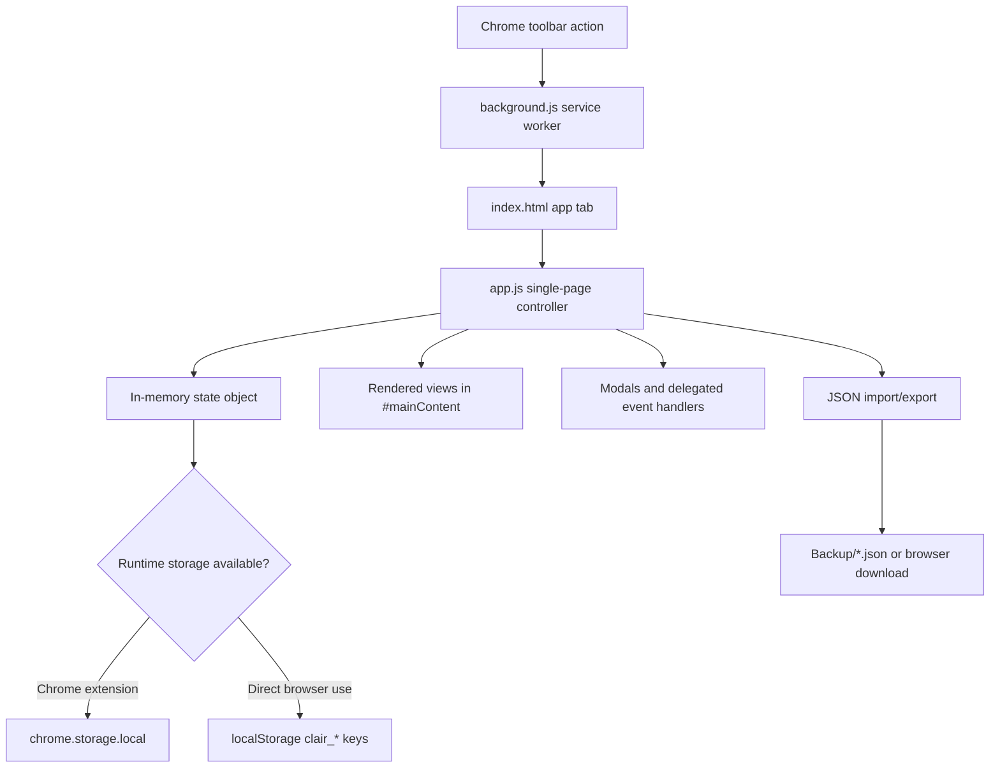
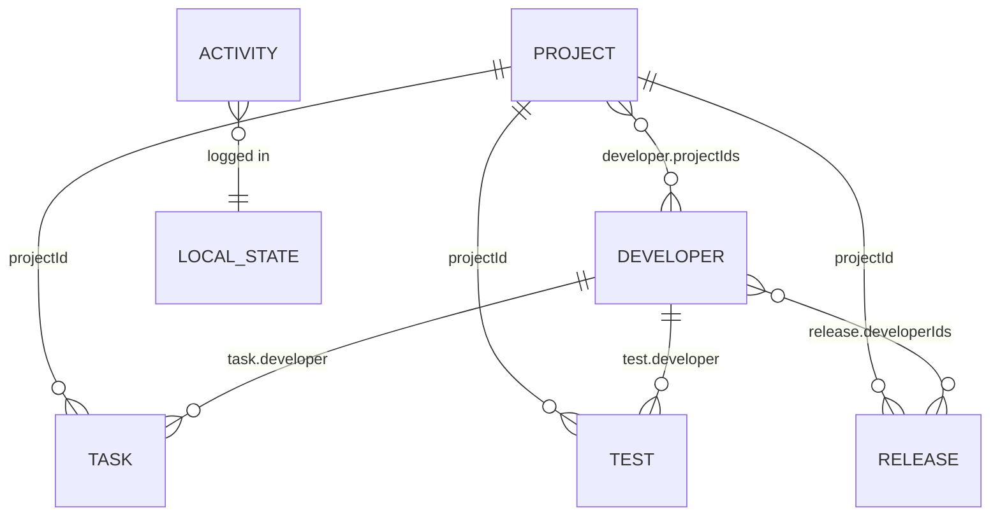

# Clair - Task & Project Tracker

## Overview

Clair is a local-first Chrome Extension and standalone browser app for tracking software projects, tasks, project insights, releases, developers, and activity history. It is implemented as a single-page vanilla HTML/CSS/JavaScript application with no build step and no backend service.

The extension opens `index.html` in a browser tab from the Chrome toolbar. Application data is saved in `chrome.storage.local` when running as an extension and falls back to `localStorage` when opened directly in a browser.

Clair is designed for an individual project/release coordinator or small internal team workflow where all records can live locally in the user's browser profile.

## Features

| Area | Implemented functionality |
| --- | --- |
| Dashboard | Counts projects, tasks, and insights; shows top project status and recent projects/tasks/insights. |
| Projects | Create, edit, delete, filter, search, and view project details. Supports web projects and app projects with platform-specific versions. |
| Tasks | Create, edit, delete, complete, search, filter, and drag tasks across a Kanban board. |
| Project Insights | Track issues, enhancements, and notes with status and assignment state. |
| Releases | Create, edit, delete, search, filter, view, copy, and generate email-style release notes. |
| Developers | Create, edit, delete developers and link them to projects. Linked developers populate task and insight dropdowns by project. |
| Activity | Local audit feed for project, task, insight, release, delete, movement, completion, and copy events. |
| Import/Export | Export projects, tasks, tests/insights, activity, and developers to JSON. Import the same JSON structure. |
| Responsive UI | Sidebar collapses behind a mobile menu on small screens; card grids and Kanban boards adapt to smaller widths. |
| Keyboard shortcuts | `Ctrl+K` / `Cmd+K` focuses global search, `Ctrl+Enter` / `Cmd+Enter` saves the active modal, `Escape` closes modals. |

## User Roles & Permissions

Clair does not implement authentication, authorization, accounts, or role-based access control.

| Role | How it exists in code | Permissions |
| --- | --- | --- |
| Local user | Anyone who can open the extension/app in the browser profile. | Full access to all screens and all create, read, update, delete, import, export, clipboard, and clear-data actions. |

There are no guest, admin, manager, moderator, vendor, customer, or super-admin roles in the current implementation.

## Screens & User Flows

Clair is a single-page app. The visible "routes" are internal view names stored in `state.view`; browser URLs do not change.

| Screen | Internal view | Purpose | Primary actions |
| --- | --- | --- | --- |
| Dashboard | `dashboard` | Overview of stored records and recent work. | Review metrics and recent items. |
| Projects | `projects` | Manage project records and version/status metadata. | Add, edit, delete, search, filter, open detail modal. |
| Tasks | `tasks` | Kanban workflow for task execution. | Add, edit, delete, complete, drag between statuses, search, filter. |
| Project Insights | `tests` | Track issues, enhancements, and notes. | Add, edit, delete, search, filter, open detail modal. |
| Release Management | `releases` | Track release logs and release-note text. | Add, edit, delete, search, filter, generate notes, copy notes. |
| Activity | `activity` | Audit trail of local actions. | Read activity entries. |
| Settings | `settings` | Data metrics, backup/restore, clear data, developer management. | Export, import, clear database, manage developers. |

### Dashboard

- Internal view: `dashboard`
- Components: metric cards, recent projects list, recent tasks list, recent insights list.
- Displays: total projects, total tasks, total tests/insights, most common project status.
- Recent records: first 4 projects, first 5 tasks, first 5 insights from the in-memory arrays.

### Projects

- Internal view: `projects`
- Components: filters bar, project card grid, empty state, project modal, detail modal, confirm modal.
- Search: global search filters project name, description, previous version, and upcoming version.
- Filters: project status, previous version, upcoming version.
- Project form fields:
  - Project name, required.
  - Description.
  - Project type: `web` or `app`.
  - Web version fields: previous release version, upcoming release version required.
  - App version fields: Android previous/upcoming and iOS previous/upcoming; both upcoming versions are required.
  - Statuses: up to 3 values from the configured project status list.
- Project statuses:
  - `N/A`, `Started`, `Stable`, `Testing`, `Automation`, `On Hold`, `Yet to Start`, `Completed`, `In Progress`, `Blocker`, `Issue Assigned`, `Developer`, `New Development`.

### Tasks

- Internal view: `tasks`
- Components: filters bar, 4-column Kanban board, task cards, task modal, detail modal, confirm modal.
- Columns: `To-Do`, `In Progress`, `Done`, `On Hold`.
- Search: page search filters task title, description, and developer name.
- Filters: exact start/end date match and project.
- Task form fields:
  - Task title, required.
  - Description.
  - Comma-separated tags.
  - Status.
  - Start date and end date.
  - Optional project.
  - Optional developer.
- Implemented interactions:
  - Drag a task card to another task column to update its status.
  - Click the round task check control to mark a task as `Done`.
  - Cards visually indicate upcoming, ongoing, overdue, due-today, and due-tomorrow states.

### Project Insights

- Internal view: `tests`
- UI label: Project Insights.
- Components: filters bar, 3-column board, insight cards, insight modal, detail modal, confirm modal.
- Columns: `Issue`, `Enhancement`, `Note`.
- Search: page search filters title, description, and developer name.
- Filters: project, developer, status, assigned status.
- Insight form fields:
  - Title, required.
  - Description.
  - Optional developer.
  - Type: `Issue`, `Enhancement`, `Note`.
  - Status: `In Dev`, `QA`, `Done`, `Known Issue`.
  - Task assigned status: `Yet to be assigned`, `Assigned`.
  - Optional project.

### Release Management

- Internal view: `releases`
- Components: release metrics, filters bar, release card grid, release modal, detail modal, confirm modal.
- Metrics: total releases, draft/planned count, active/testing/approved count, released count, rolled-back count.
- Search: page search filters release name, version, description, work items, and manager name.
- Filters: release status.
- Release statuses:
  - `Draft`, `Planned`, `In Progress`, `Testing`, `Approved`, `Released`, `Rolled Back`.
- Release form fields:
  - Project, required.
  - Release version, required and derived from the selected project's configured versions.
  - Release name, required.
  - Release date.
  - Description.
  - Release manager/owner.
  - Release status.
  - Product developer checklist.
  - Work items.
  - Release notes text area.
- Release note tools:
  - `Generate Template` fills the release notes field with an email-style release announcement.
  - The copy button copies saved notes to the clipboard; if notes are empty, it generates a fallback text from the release fields.

### Activity

- Internal view: `activity`
- Components: activity list and empty state.
- Stores the newest 200 entries.
- Activity entry fields: id, text, type, timestamp.
- Activity types used in code: `task`, `project`, `delete`.

### Settings

- Internal view: `settings`
- Components: system overview, data portability buttons, danger zone, developer management form/list.
- System overview: project count, task count, test/insight count, approximate serialized state size.
- Data portability: export and import JSON.
- Danger zone: clear all in-memory/storage records after first triggering an export.
- Developer form fields:
  - Developer name, required.
  - Linked project checkboxes.
- Developer effects:
  - Task and insight developer dropdowns can be filtered to developers linked to the selected project.
  - Deleting a developer clears matching developer assignments from tasks and insights.

## System Architecture



### Frontend

- Framework: none; vanilla JavaScript.
- Markup: `index.html`.
- Styling: `style.css`.
- Runtime controller: `app.js`.
- Rendering model: string templates assigned into `#mainContent`.
- Routing: internal state-based view switching; no URL router.
- State management: module-level `state` object in `app.js`.
- Persistence: custom `storage.load()` and `storage.save()` helpers.
- Forms: native inputs/selects/textareas and modal dialogs implemented with HTML/CSS/JS.
- Validation: inline JavaScript checks for required fields.
- Data fetching: none.
- External fonts: Google Fonts for DM Sans and DM Mono.

### Extension Runtime

- Manifest: Chrome Extension Manifest V3.
- Service worker: `background.js`.
- Action behavior: clicking the extension icon focuses an existing Clair tab if one is known; otherwise it opens `index.html`.
- Chrome permissions:
  - `storage` for `chrome.storage.local`.
  - `tabs` for opening/focusing the app tab.
  - `downloads` for backup downloads.

### Backend

There is no backend framework, HTTP API, middleware, server-side authentication, background queue, webhook handler, or server database.

## Technology Stack

| Layer | Technology |
| --- | --- |
| Browser extension | Chrome Manifest V3 |
| UI | HTML5, CSS3, inline SVG icons |
| Logic | Vanilla JavaScript |
| Storage | `chrome.storage.local` with `localStorage` fallback |
| Downloads | Chrome Downloads API with anchor-download fallback |
| Clipboard | `navigator.clipboard.writeText` |
| Fonts | Google Fonts: DM Sans, DM Mono |

## Folder Structure

```text
.
├── app.js
├── background.js
├── index.html
├── manifest.json
├── style.css
├── assets/
│   ├── icon16.png
│   ├── icon48.png
│   └── icon128.png
└── Backup/
    └── clair-export-YYYY-MM-DD*.json
```

| Path | Purpose |
| --- | --- |
| `manifest.json` | Chrome extension metadata, permissions, action, service worker, and icon references. |
| `background.js` | MV3 service worker that opens/focuses the Clair app tab. |
| `index.html` | Static shell, sidebar/topbar, modals, form controls, and script/style references. |
| `app.js` | State, persistence, rendering, validation, import/export, activity logging, and event handling. |
| `style.css` | Layout, design tokens, responsive behavior, cards, boards, modals, toasts, and detail views. |
| `assets/` | Extension icons. |
| `Backup/` | Existing exported JSON backup files. New extension exports target this folder path via the Chrome Downloads API. |

## Installation

### Development Setup

Prerequisites:

- Google Chrome or a Chromium-based browser.
- No Node.js, package manager, bundler, or database is required.

Run as an unpacked Chrome extension:

1. Open `chrome://extensions`.
2. Enable Developer mode.
3. Click `Load unpacked`.
4. Select this project folder.
5. Click the Clair extension icon to open the app tab.

Run as a standalone local web page:

1. Open `index.html` directly in a browser.
2. Data will be stored in `localStorage` under keys prefixed with `clair_`.

### Production Setup

There is no production server or container setup in this repository.

For Chrome distribution, package the folder as a Chrome extension after verifying the Manifest V3 requirements and icons. For internal/local use, the unpacked extension workflow is the implemented deployment path.

## Environment Variables

No environment variables are read by the current codebase.

| Variable | Purpose | Required | Example |
| --- | --- | --- | --- |
| None | Not applicable. | No | Not applicable. |

## Database

Clair does not use a database server, ORM, migrations, SQL schema, IndexedDB, Redis, or search index. Data is persisted as JSON-compatible arrays in browser storage.

### Stored Collections

| Collection | Stored in active storage | Exported | Imported | Description |
| --- | --- | --- | --- | --- |
| `projects` | Yes | Yes | Yes | Project records and version/status metadata. |
| `tasks` | Yes | Yes | Yes | Kanban task records. |
| `tests` | Yes | Yes | Yes | Project insight records. |
| `activity` | Yes | Yes | Yes | Activity feed entries. |
| `developers` | Yes | Yes | Yes | Developer registry records. |
| `releases` | Yes | No | No | Release records. Current import/export code omits this collection. |

### Data Relationships



### Record Shapes

Project records:

```json
{
  "id": "string",
  "name": "string",
  "description": "string",
  "projectType": "web | app",
  "previousVersion": "string",
  "upcomingVersion": "string",
  "androidPreviousVersion": "string",
  "androidUpcomingVersion": "string",
  "iosPreviousVersion": "string",
  "iosUpcomingVersion": "string",
  "statuses": ["string"],
  "createdAt": "ISO timestamp",
  "updatedAt": "ISO timestamp"
}
```

Task records:

```json
{
  "id": "string",
  "title": "string",
  "description": "string",
  "tags": ["string"],
  "startDate": "YYYY-MM-DD",
  "endDate": "YYYY-MM-DD",
  "status": "To-Do | In Progress | Done | On Hold",
  "projectId": "string",
  "developer": "developer id",
  "createdAt": "ISO timestamp",
  "updatedAt": "ISO timestamp"
}
```

Insight records:

```json
{
  "id": "string",
  "title": "string",
  "description": "string",
  "developer": "developer id",
  "type": "Issue | Enhancement | Note",
  "status": "In Dev | QA | Done | Known Issue",
  "assignedStatus": "Yet to be assigned | Assigned",
  "projectId": "string",
  "createdAt": "ISO timestamp",
  "updatedAt": "ISO timestamp"
}
```

Release records:

```json
{
  "id": "string",
  "name": "string",
  "version": "string",
  "description": "string",
  "managerName": "string",
  "status": "Draft | Planned | In Progress | Testing | Approved | Released | Rolled Back",
  "workItems": "string",
  "notes": "string",
  "developerIds": ["developer id"],
  "projectId": "string",
  "releaseDate": "YYYY-MM-DD",
  "createdAt": "ISO timestamp",
  "updatedAt": "ISO timestamp"
}
```

Developer records:

```json
{
  "id": "dev-string",
  "name": "string",
  "projectIds": ["project id"]
}
```

Activity records:

```json
{
  "id": "string",
  "text": "string",
  "type": "task | project | delete",
  "at": "ISO timestamp"
}
```

## API Documentation

There are no HTTP API endpoints in the current project. All operations happen inside the browser through direct JavaScript function calls and browser APIs.

| API surface | Implemented calls |
| --- | --- |
| Chrome Extension APIs | `chrome.action.onClicked`, `chrome.tabs.get`, `chrome.tabs.update`, `chrome.tabs.create`, `chrome.windows.update`, `chrome.tabs.onRemoved`, `chrome.storage.local.get`, `chrome.storage.local.set`, `chrome.downloads.download`, `chrome.runtime.getURL`. |
| Web APIs | `localStorage`, `FileReader`, `Blob`, `URL.createObjectURL`, `navigator.clipboard.writeText`, DOM events, HTML drag-and-drop. |

## Integrations

| Integration | Purpose | Required |
| --- | --- | --- |
| Chrome Extension APIs | Opening/focusing the app tab, local extension storage, and backup downloads. | Required for extension mode. |
| Browser Web APIs | Local fallback storage, import file parsing, export blob creation, clipboard copy, DOM rendering/events. | Required. |
| Google Fonts | Loads DM Sans and DM Mono from `fonts.googleapis.com`. | Optional for functionality; affects typography. |

No OpenAI, Anthropic, Stripe, Razorpay, Firebase, AWS, Google API product, Twilio, SendGrid, Supabase, PostgreSQL, Redis, Elasticsearch, analytics, notification, payment, webhook, or AI integration is implemented.

## Development Workflow

This repository has no package manifest and no automated build commands. Typical development is direct file editing:

1. Edit `index.html`, `style.css`, `app.js`, `background.js`, or `manifest.json`.
2. Reload the unpacked extension in `chrome://extensions`.
3. Reopen or refresh the Clair tab.
4. Test create/edit/delete/import/export flows manually.

Useful manual checks:

- Extension icon opens Clair and focuses the same tab on subsequent clicks.
- Projects can be created for both `web` and `app` project types.
- Tasks move between Kanban columns via drag-and-drop.
- Developer dropdowns respond to selected projects.
- Release version dropdowns populate from the selected project.
- Export creates a JSON backup.
- Import restores projects, tasks, tests, activity, and developers.

## Build & Deployment

No build step is configured.

Deployment options currently supported by the code:

| Target | Method |
| --- | --- |
| Local Chrome extension | Load the repository as an unpacked extension. |
| Static browser page | Open `index.html` directly. |
| Packaged extension | Use Chrome's extension packaging flow after local verification. |

There are no Dockerfiles, CI/CD workflows, hosting configuration, infrastructure-as-code files, monitoring setup, or production server scripts in the repository.

## Testing

No automated tests are present in the repository. There is no test runner, test framework, CI test command, or coverage configuration.

Current verification is manual browser testing of the extension and standalone page behavior.

## Security Features

Implemented:

- Local-only storage; no server transmission is implemented.
- Delete actions use a confirmation modal.
- Clear database triggers an export attempt before wiping local state.
- Required-field validation prevents saving incomplete key records.
- Search input is escaped before building the highlight regular expression.

Not implemented:

- Authentication.
- Authorization.
- Encryption at rest.
- Sync conflict handling.
- Passwords, MFA, sessions, or email verification.
- Server-side validation.
- Content Security Policy customization beyond browser/extension defaults.

Security note: several render paths interpolate stored text into HTML strings. Treat imported JSON as trusted local data unless the rendering is hardened.

## Performance Optimizations

- Single static app with no runtime framework overhead.
- Event delegation is used for cards, filters, search, and drag/drop inside `#mainContent`.
- Search inputs are debounced before rendering.
- Activity entries are capped at 200 records.
- Storage indicator uses a simple item-count estimate against 200 records.
- CSS media queries adapt layout for tablet and mobile widths.

## Troubleshooting

| Issue | Likely cause | Resolution |
| --- | --- | --- |
| Extension icon does not open the app | Extension not loaded or disabled. | Reload the unpacked extension in `chrome://extensions` and click the toolbar icon again. |
| Data differs between extension and direct `index.html` | Extension mode uses `chrome.storage.local`; direct file mode uses `localStorage`. | Use one runtime mode consistently or export/import between modes. |
| Release records are missing after import | Current export/import code omits `releases`. | Recreate releases manually or update import/export code to include `releases`. |
| Developer dropdown is empty after selecting a project | No developers are linked to that project. | Link developers to the project in Settings. |
| Release version dropdown is empty | Selected project has no configured versions for its project type. | Edit the project and add previous/upcoming version values. |
| Clipboard copy fails | Browser clipboard API is unavailable or blocked. | Use a secure context/extension tab and retry. |
| Google font styling does not load | Network access to Google Fonts is blocked. | The app still works using system font fallbacks. |

## Contributing

When changing the app, keep the implementation consistent with the current architecture:

- Prefer vanilla HTML, CSS, and JavaScript unless a larger migration is intentional.
- Keep storage shape changes backward-compatible with existing backup files where possible.
- Update this README when adding views, fields, storage collections, permissions, or browser APIs.
- Manually test extension mode and direct-browser fallback mode after persistence changes.

## License

No license file is present in this repository. Usage and distribution rights are unspecified until a license is added.
